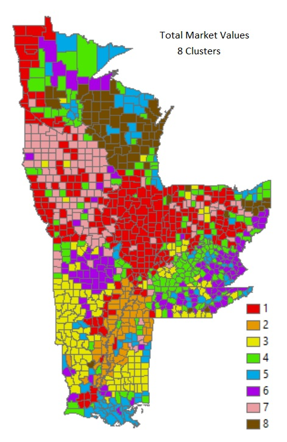
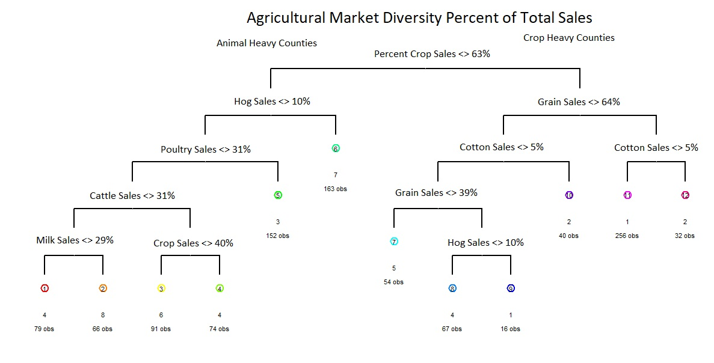

Crop Diversity and Resilience
================
Mandy Liesch

-   [Agricultural Production
    Patterns](#agricultural-production-patterns)
    -   [Animal Heavy Counties](#animal-heavy-counties)
    -   [Mixed/Balanced Counties](#mixedbalanced-counties)
-   [Agricultural Intensification](#agricultural-intensification)

# Agricultural Production Patterns

The USDA NASS has a map
[gallery](https://www.nass.usda.gov/Publications/AgCensus/2017/Online_Resources/Ag_Census_Web_Maps/Overview/)
of all of the 2017 Agricultural production statistics. We are looking to
attempt to create an agricultural diversity index to gauge the potential
community resilience to climate change. This study looks at the total
percent of market sales (NOT INCLUDING OVERALL SALES VOLUMES), to see a
full picture of what agricultural industries have value in each county.

!!!!!!Add Overall Market Values

Diverse communities with more than one income channel should, in theory,
be at less risk. There are also several studies about how crop yields
are projected to decline, or aggressively decline. Animal production,
especially outdoors, will also experience issues and risks, usually tied
with the overall biomass production declines and heat stress.

  
Using hierarchical clustering, we can find 8 major agricultural
production clusters . Counties that are heavily crop reliant (1, 2, and
5), and counties that are predominantly animal reliant. The overall
categorical tree is below, describing a basic flow of how each category
shakes out.

  
## Crop Heavy Counties The primary branch breaks total counties into two
groups, those with greater than 63% of their agricultural market being
crop based (right branch), and those with less.

Group 1: Counties that have more than 64% of sales in the grain market
(value of grains includes corn, oilseeds, dry beans, and dry peas sold
as percent of total market), AND less than 5% of areas in cotton. IF
grain sales beween 40-64%, these areas are classified as group 1 if they
have more than 10% of their market value in hogs. This area includes the
Red River Valley of the North, Western Iowa, as well as Iowa and
Indiana.

Group 2: Like Group 1, this area is predominately crop driven, and has a
cotton market value taking up more than 5% of the county.

Group 5: This group will require a further breakdown of analysis. These
are counties that are diverse and unique. A majority of their revenue
comes from cropping: however, less than 40% of it comes from traditional
grain crops, and there is very low cotton production \<5%. These areas
exist in several of the urban centers (likely vegetable and farm to
table operations), Northern Wisconsin (cranberries, fruits, potatoes,
and vegetables), Mississippi (melons) and Southern LA (sugarcane).

## Animal Heavy Counties

Group 3: This group of counties are generally poultry based (More than
31% of income), and have a pretty low hog population market value.

Group 6: These counties are cattle heavy counties, with over 31% market
value of sales in cows. These counties also make less than 40% of all
income on crops. These are areas that are much less suitable for crop
growth (the Ozarks and Appalachian regions), and the area is likely
heavy in beef cattle production.

Group 7: These are the hog juggernauts. These counties make less than
64% of their income on cropping, BUT, more than 10% on hogs. This area
produces a ton of grains, from an acreage standpoint, however, the hogs
are the primary economic drivers. This area encompasses Southern
Minnesota, and Northern Iowa

Group 8: Balanced Dairy. These areas make more than 30% of their income
from dairy related sales.

## Mixed/Balanced Counties

Group 4: There are several subgroups in this section, as it a diverse
catch all. Those made up less than 30% of income is from dairy or cattle
sales, others have \>30% cattle sales, with \>40% of their income coming
from crops. The final group has a greater level of crop sales \>64%,
between 40-64% grain sales, but is low on hog sales. This region
includes the tobacco regions of Kentucky, and a lot of floriculture and
nursery area. This group needs further analysis to shake down patterns.

# Agricultural Intensification
