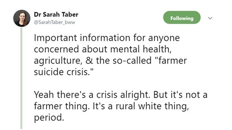
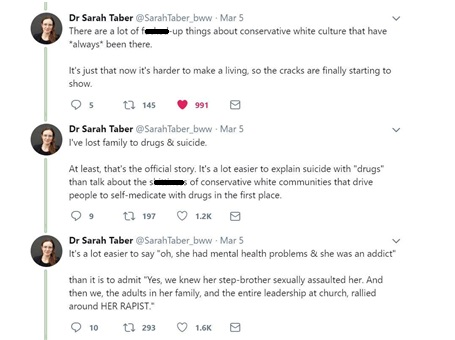
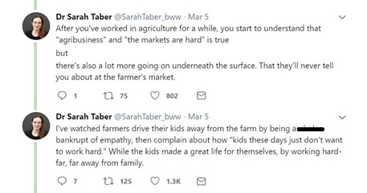
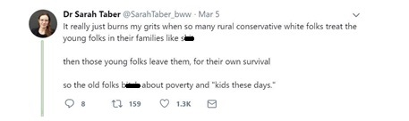
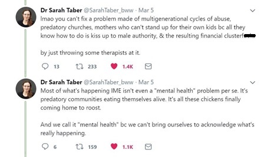

The Dark Underbelly: Rural America and the True Believer
================
Mandy Liesch

-   [Introduction](#introduction)
-   [What is the True Believer?](#what-is-the-true-believer)
-   [The New Poor](#the-new-poor)
-   [Frustration](#frustration)
-   [Passionate Hatred](#passionate-hatred)

``` r
rmarkdown::render("rural-americas-dark-underbelly.Rmd", 
                  output_format = "github_document", 
                  output_options = list(toc=TRUE, toc_depth = 3, html_preview=FALSE), 
                  output_file = "DarkRisk.md")
```

## Introduction

There are a lot of images, pictures, and stereotypes that pop up when
the notion of “rural America” gets brought up in conversation. This is
especially true around election time. In the wake of the 2016 election,
several monolithic pictures went out portraying the rural communities as
“uneducated, anti-intellectual, hick bumpkins, clinging to God and guns
over the lives and cultures of their fellow Americans.” This was paired
by peoples complete and total surprise on Hilary Clinton’s loss. How did
we miss it?, followed by deep narratives on the “East Coast Elite” and
“Ivory Towers” being out of touch with the real economic problems of
REAL AMERICA.

But this isn’t just about an election. That is a vast oversimplication
of a problem that is much more insidious, wide spread, and dangerous
than most people realize.

This risk is one of the biggest threats to our country, and the world
around us, and it woven into the complex social and cultural dynamics
that make up the region. These issues extend beyond economic security
and simple population loss, and pull into the very psyche, and create
conditions right for fundamentalism and extreme nationalism: the True
Believers.

This section documents the cross sections of America, rural identity,
toxic culutral beliefs, and the cycles of despair and multigenerational
trauma that left open a vacuum that needed to be filled by a savior, and
what precipitated this fall.

## What is the True Believer?

In 1951, American Social Philosopher Eric Hoffer wrote the book “[The
True Believer: : Thoughts on the Nature of Mass
Movements](https://en.wikipedia.org/wiki/The_True_Believer). This book
touched on the reasons why mass movements get started, and how they grip
people, pulling at our deepset psychological needs, creating a call for
action. There are several main sections of this book, but this research
on the American Mississippi and Ohio River Basins are focusing on three
major points:  
- The New Poor  
- Frustration  
- Passionate Hatred

## The New Poor

> The “New Poor” are a different group of people than the extremely
> poor. They are anyone in society that used to be doing well, but now
> are relatively worse off. The New Poor are the most likely group to
> join mass movements.

This section deeps into a deep nostalgia for the times that life really
was better. Even for those that have not fallen yet, there is a distinct
fear that their jobs are next, their security will disappear follow.
This map looks at:  
- Industry Specific Employment Trends, including farming.  
- Debt to asset ratios (farming and personal)  
- Income and Poverty  
- Loss of Farms, and Agricultural Diversity

## Frustration

> A “true believer” who becomes part of a mass movement feels
> frustrated, forgotten and individually powerless. When people feel
> powerless and frustrated, the freedom they deeply ache for is a
> freedom FROM individual responsibility.

Internal reflection IS HARD. It is much easier to blame failures on
anything, or everything else. It is a way that people preserve their
self-respect and health, especially when things have not been going
well. It is the fault of: the economy, “the system,” the government,
capitalism, high taxes… anything outside themselves.

This feeds back into rural culture, and some of the toxic cultural
traits that are difficult to talk about. This section addresses some of
the toxic cultural beliefs partially responsible for:  
- Rural Identity and Independence in a changing world  
- Population Losses and Loss of Representation  
- Deaths from Despair (Suicides/Overdoses)

 
  
  


## Passionate Hatred

> Mass movements can rise and spread without belief in a God, but never
> without belief in a devil.

Movements need a scapegoat to redirect hate and blame to compensate for
their own personal failures. All failures of the movement to accomplish
their goals can also be blamed on the enemy. In the case of nationalism,
the enemy rotates and depends on who is talking (liberals, anyone who
deviates from “historic normal”, immigrants, etc.)

This section is probably the most frightening, and deals with the
crumbling journalism sector, and how this rapid shift led to the
cultivation of the echo chambers.

Topics Include:  
- Rural School Closures  
- Mass Media Consolidation and the Loss of Newspapers  
- The rise of right wing local news
