```{r setup, include=FALSE}
knitr::opts_chunk$set(echo = TRUE)
library(rmarkdown)
library(tufte)
library(usethis)
library(knitr)
use_git_config(user.name="Mandy Liesch", user.email="amliesch@ncsu.edu")
```

```{r, eval=FALSE, message = FALSE, warning=FALSE}
rmarkdown::render("rural-americas-dark-underbelly.Rmd", 
                  output_format = "github_document", 
                  output_options = list(toc=TRUE, toc_depth = 3, html_preview=FALSE), 
                  output_file = "DarkRisk.md")
```

## Introduction

There are a lot of images, pictures, and stereotypes that pop up when the notion of "rural America" gets brought up in conversation. This is especially true around election time. In the wake of the 2016 election, several monolithic pictures went out portraying the rural communities as "uneducated, anti-intellectual, hick bumpkins, clinging to God and guns over the lives and cultures of their fellow Americans." This was paired by peoples complete and total surprise on Hilary Clinton's loss. How did we miss it?, followed by deep narratives on the "East Coast Elite" and "Ivory Towers" being out of touch with the real economic problems of REAL AMERICA.

But this isn't just about an election. That is a vast oversimplication of a problem that is much more insidious, wide spread, and dangerous than most people realize. 

This risk is one of the biggest threats to our country, and the world around us, and it woven into the complex social and cultural dynamics that make up the region. These issues extend beyond economic security and simple population loss, and pull into the very psyche, and create conditions right for fundamentalism and extreme nationalism: the True Believers.  

This section documents the cross sections of America, rural identity, toxic culutral beliefs, and the cycles of despair and multigenerational trauma that left open a vacuum that needed to be filled by a savior, and what precipitated this fall.

## What is the True Believer?
In 1951, American Social Philosopher Eric Hoffer wrote the book "[The True Believer: : Thoughts on the Nature of Mass Movements ](https://en.wikipedia.org/wiki/The_True_Believer). This book touched on the reasons why mass movements get started, and how they grip people, pulling at our deepset psychological needs, creating a call for action. There are several main sections of this book, but this research on the American Mississippi and Ohio River Basins are focusing on three major points:  
- The New Poor  
- Frustration  
- Passionate Hatred  

## The New Poor
> The “New Poor” are a different group of people than the extremely poor. They are anyone in society that used to be doing well, but now are relatively worse
off. The New Poor are the most likely group to join mass movements.

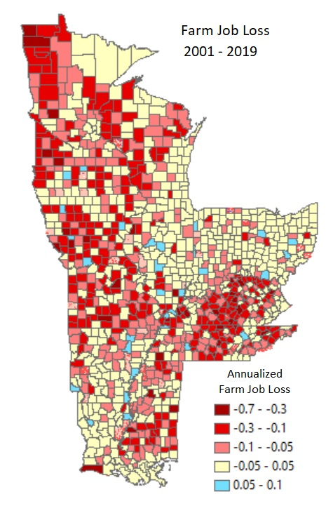  
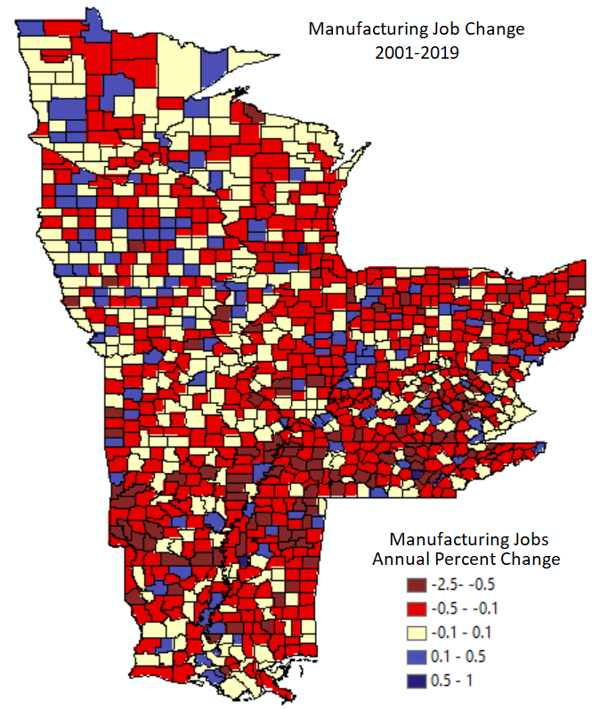  


## Frustration
> A “true believer” who becomes part of a mass movement feels frustrated, forgotten and individually powerless. When people feel powerless and frustrated, the freedom they deeply ache for is a freedom FROM individual responsibility.

### Population Losses and Loss of Representation   

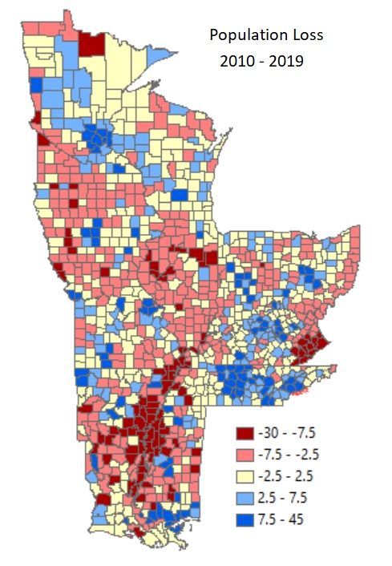 

People cling to their rural roots, even if they no longer are there. Politicians never did a good job listening to rural constituents, and as urban areas continue to grow in population, representation is removed from remote communities. 

>Republican state legislatures will try to draw districts that preserve the political power of most rural voters, but that task will become increasingly difficult as the population balance shifts toward cities.

This loss of voice is real, and feels very profound, and as farm fields are gobbled up by urban areas, the loss of roots and rural connection creates a sense of nostalgia, as well as fear of losing the world as they know it, creates frustration that can be capitalized on. 

### Rural Identity and Independence 
We... don't need farmers anymore. Does rural America even really need to exist?

Like manufacturing, increasing efficiency and mechanization, as well as corporate consolidation, has reduced the needs of people to even exist in a lot of these areas. 

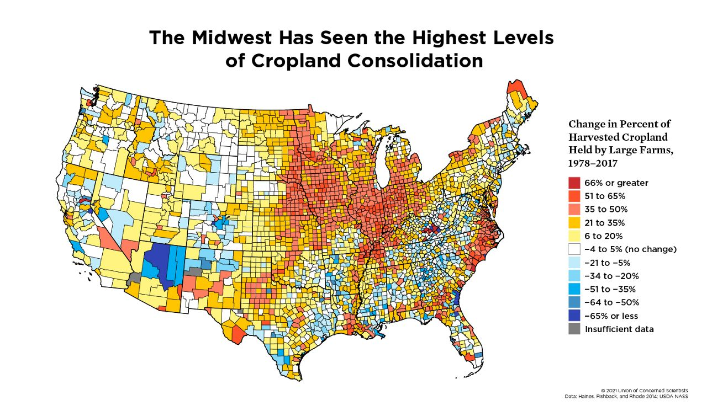  
Wisconsin ALONE lost 2,515 dairy farms from 2017-2021. 

People are leaving for centers where jobs are, leaving behind those that are too old, too poor, or too stagnant to deal with change. And those that are left behind, are increasingly isolated, and frustrated.

>By almost every measure of mental health, the countryside now does worse than the big city, and the amount of pathology increases as you go from metropolis to suburb to small town. 

### Toxic Cultural Traits
Internal reflection IS HARD. It is much easier to blame failures on anything, or everything else. It is a way that people preserve their self-respect and health, especially when things have not been going well. It is the fault of: the economy, “the system,” the government, capitalism, high taxes… anything outside themselves. 

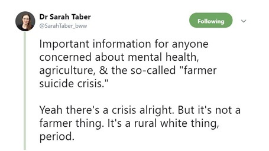
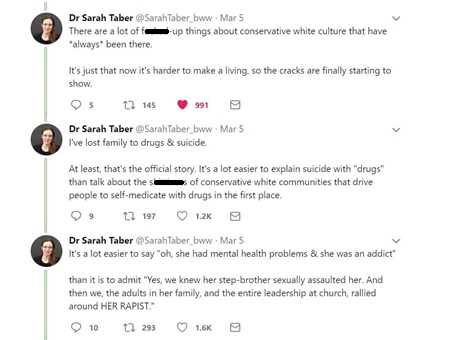
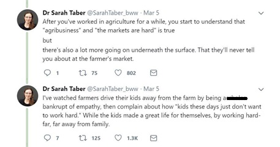  
  
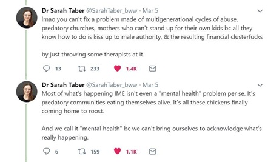  

These are hard conversations that feed back into rural culture. People are not just leaving because there is a decreasing need for manual labor, but they are leaving because they want to get out. 

Rural communities are close knit communities that relied on cohesion or death. When you are focused on surviving, satisfaction is gained from a full belly from a full days work. Once relative wealth increased, our interactions as communities and families needed to change and adjust. But, a lot of times it didn't. 

>There is some toxic factor in rural and small-town life itself that makes people mentally ill, or turns them towards drugs.

A lot of these long term family dynamics are elements of ourselves that can be downright toxic. And unless we are in good contact with ourselves, we are not even aware we have, and that makes them difficult to talk about. 

### Deaths from Despair

Another issue, borne from pain and shame, the loss of identity, and livelihood, paired with pain, and poverity comes escapism. Brought about by substance abuse, the deeper the impact roots in, the more pain results.

>For young people, rates of opioid use in the past year were twice as high among rural teens and young adults as in the nation as a whole.

 
(Suicides/Overdoses/Alcoholism)  
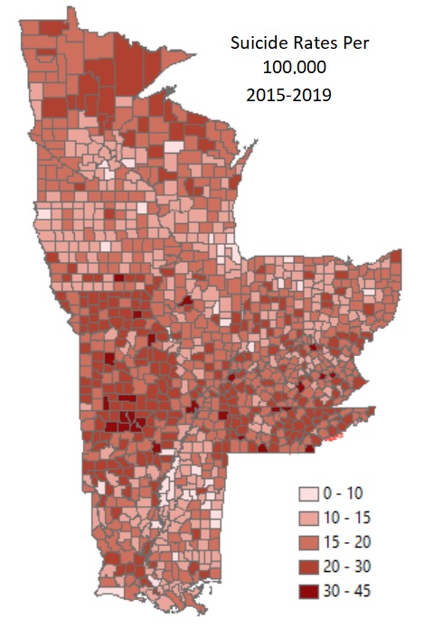  

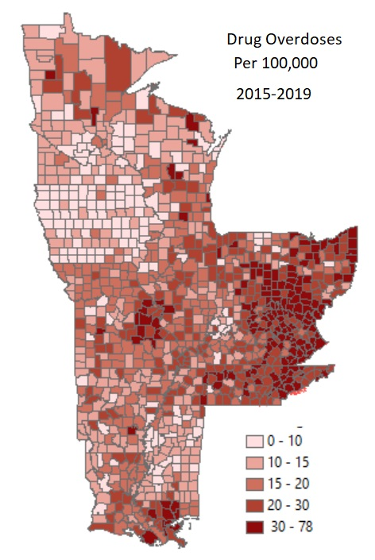 
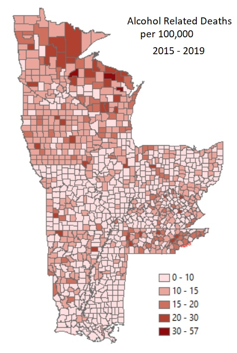 

Watching the older men and leaders of the community members lose hope, fuels the desperate need for purpose. 


## Passionate Hatred  
>Mass movements can rise and spread without belief in a God, but never without belief in a devil. 


Movements need a scapegoat to redirect hate and blame to compensate for their own personal failures.  All failures of the movement to accomplish their goals can also be blamed on the enemy. In the case of nationalism, the enemy rotates and depends on who is talking (liberals, anyone who deviates from "historic normal", immigrants, etc.) 

This section is probably the most frightening, and deals with the crumbling journalism sector, and how this rapid shift led to the cultivation of the echo chambers.

### Rural School Closures
In a lot of communities, rural schools provide the lifeblood.  
- Usually the towns biggest employer  
- communities with schools have two times the property value  
- A school board shapes a school’s leadership and policies and future.

>For poor rural communities of color, these schools can serve as a counterweight to the long-lasting power of those with land and money. 

Local schools can also lead to the closure of local businesses and expedite population losses. Mapping the trends are difficult right now, as there are very few. 

### Mass Media Consolidation and the Loss of Newspapers 
Democracy dies in the darkness is not just a slogan of a famous newspaper. Local news and newspapers, like rural schools, form the hub of how rural communities communicate. 
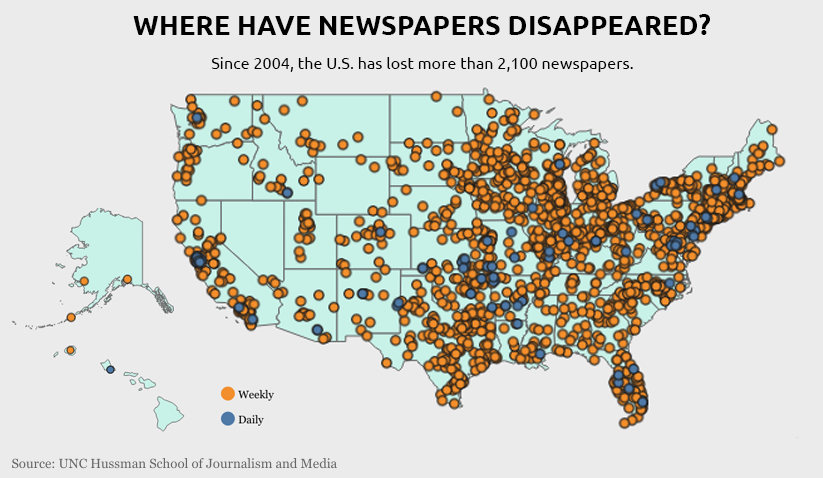 


### The Rise of Conservative Media
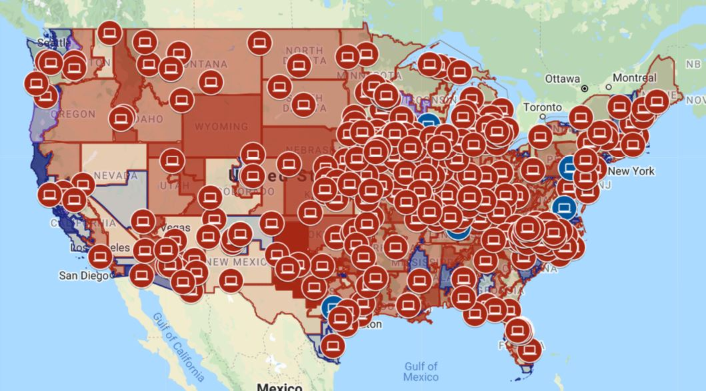


## Conclusions
When you tie all of these threads together, you wind up with a newly poor, frustrated group of agitators, brimming with energy and passion to make a difference in their world. This True Believer style energy was in need of a voice, and then a man came along who heard them, and understood their frustration and anger.


  

